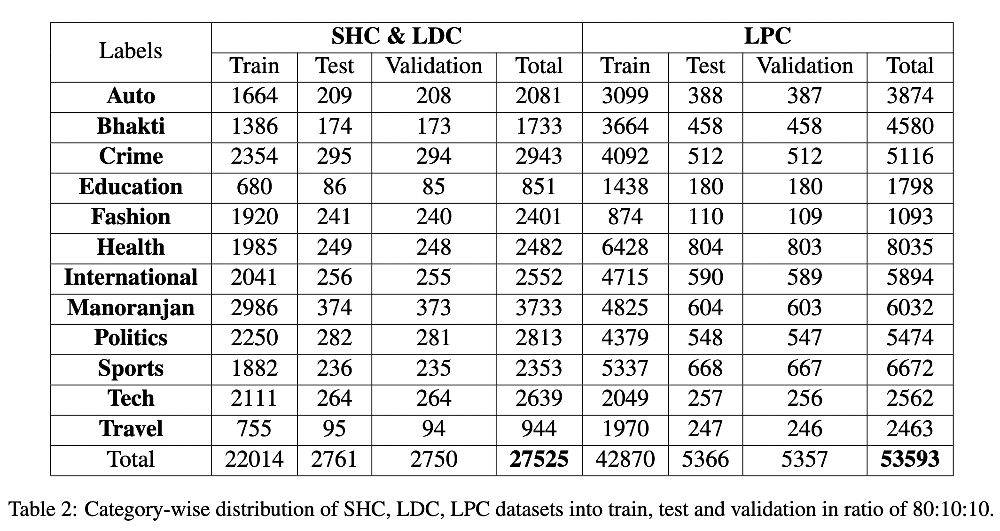
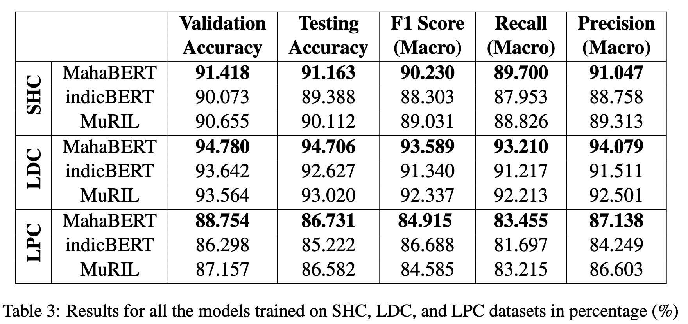

# L3Cube-MahaNews

L3Cube-MahaNews is a long, medium, and short document classification dataset in Marathi. The dataset is based on News articles and headlines.

## Data Statistics


## Results


## Citing
```
@article{joshi2022l3cube,
  title={L3Cube-MahaNLP: Marathi Natural Language Processing Datasets, Models, and Library},
  author={Joshi, Raviraj},
  journal={arXiv preprint arXiv:2205.14728},
  year={2022}
}
```
